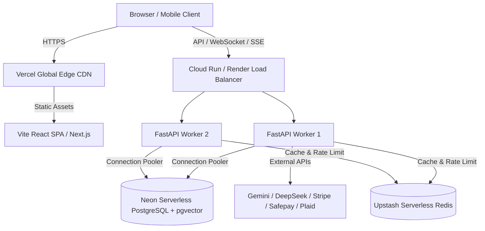

# Implementation Plan: Future Phases 20, 21 & 22 (DevOps, i18n & Cloud Deployment)

This document provides a production-ready, future-proof architectural blueprint and implementation plan for the final post-hackathon operational stages of the **ROXY Personal AI** platform:
- **Phase 20**: Docker Compose One-Click Development & Testing Stack (`specs/feature/docker-compose.md`)
- **Phase 21**: Complete Internationalization (i18n), Urdu/Arabic Localization & RTL Layout (`specs/feature/ui-theming-i18n.md`)
- **Phase 22**: Production Cloud Deployment, CI/CD Pipelines & Serverless Infrastructure (Vercel, Google Cloud Run/Render, Neon PostgreSQL, Upstash Redis)

---

## User Review Required

> [!IMPORTANT]
> **Container Parity**: Phase 20 introduces containerization for both the FastAPI backend and Vite/Next.js frontend alongside PostgreSQL with `pgvector` and Redis. All volume mounts will support hot-reloading for rapid local development.

> [!IMPORTANT]
> **Bi-Directional RTL Layout**: Phase 21 introduces right-to-left (RTL) text direction and mirror layout adjustments for Urdu (`ur`) and Arabic (`ar`). This requires CSS logical properties (`margin-inline-start`, `inset-inline-start`, `text-align: start`) across all 19 autonomous studios.

> [!WARNING]
> **Production Secrets & Zero-Leak Invariant**: Phase 22 cloud deployment configurations must strictly use environment variable secret injection (e.g., Google Secret Manager or Vercel Environment Variables). No live keys (Stripe, Safepay, Plaid, Gemini, OpenAI) may be bundled in Docker images or client build artifacts.

---

## Open Questions

> [!NOTE]
> **Frontend Target for Docker**: Should the default Docker Compose frontend service target the primary **Vite React 18 SPA** (`frontend/`) on port 5173/3000, or the **Next.js frontend** (`nextjs-frontend/`)? *(Recommended: Configure the primary Vite SPA as default, with an optional profile for Next.js).*

> [!NOTE]
> **AI Translation vs. UI Translation**: Should AI-generated responses automatically translate to the active UI language (e.g., Arabic/Urdu), or should the language switcher solely translate the interface chrome while allowing the user to select the model's communication language independently? *(Recommended: Independent model language instruction injected into system prompt).*

---

## Phase 20: Docker Compose One-Click Stack

### Objective
Provide developers and evaluators with a single-command setup (`docker compose up`) that spins up the complete ROXY stack with local container parity, database migration automation, and zero configuration friction.

### Proposed Changes

#### 1. Backend Containerization
- **[NEW] `backend/Dockerfile`**:
  - Multi-stage build based on `python:3.12-slim`.
  - Install system dependencies (`curl`, `build-essential`, `libpq-dev`, `ffmpeg`).
  - Install dependencies via `pip install --no-cache-dir -e .` with caching layer.
  - Expose port `8000`.
  - Health check probe targeting `GET /health/live`.
  - Command: `uvicorn app.main:app --host 0.0.0.0 --port 8000 --reload`.
- **[NEW] `backend/entrypoint.sh`**:
  - Wait for PostgreSQL to become healthy using `pg_isready`.
  - Execute Alembic migrations: `alembic upgrade head`.
  - Launch Uvicorn application server.

#### 2. Frontend Containerization
- **[NEW] `frontend/Dockerfile`**:
  - Multi-stage development & production Dockerfile based on `node:20-alpine`.
  - Dev target: Mounts `src/`, runs `npm run dev -- --host 0.0.0.0 --port 5173`.
  - Prod target: Runs `npm run build`, serves static assets via lightweight `nginx:alpine` with SPA rewrite rules.
- **[NEW] `frontend/nginx.conf`**:
  - Configures gzip compression, client-side routing fallback (`try_files $uri $uri/ /index.html`), security headers, and `/api/` reverse proxy to backend.

#### 3. Compose Orchestration
- **[NEW] `docker-compose.yml`**:
  - **`db`**: `pgvector/pgvector:pg16` image, persistent volume `roxy_pgdata`, health check on port `5432`.
  - **`redis`**: `redis:7-alpine`, persistent volume `roxy_redisdata`, health check on port `6379`.
  - **`backend`**: Depends on `db` and `redis` (condition: `service_healthy`). Ingests `.env` or defaults to container network URLs (`postgresql+asyncpg://postgres:postgres@db:5432/roxy_dev`).
  - **`frontend`**: Depends on `backend` (condition: `service_started`). Port mapping `3000:5173` (or `5173:5173`).
- **[NEW] `docker-compose.override.yml.example`**:
  - Developer customization template for local port mappings, debugger attach ports, and volume overrides.
- **[MODIFY] `backend/.env.example` & `frontend/.env.example`**:
  - Document Docker network connection strings (`http://backend:8000`, `redis://redis:6379/0`).

---

## Phase 21: Full i18n & Localization (English, Urdu, Arabic)

### Objective
Make ROXY fully localized for global and regional adoption (Pakistan and Middle East markets) with dynamic language switching, full RTL layout mirroring, and localized numbers and dates.

### Proposed Changes

#### 1. i18n Core Framework & State Management
- **[NEW] `frontend/src/i18n/`**:
  - **`i18n.ts`**: Lightweight, type-safe localization hook and context (`I18nContext`, `useTranslation`).
  - **`locales/en.json`**: English strings (source of truth).
  - **`locales/ur.json`**: Urdu strings (اردو — localized labels, studio descriptions, actions).
  - **`locales/ar.json`**: Arabic strings (العربية — modern standard Arabic).
  - Persistence: Persists selection in `localStorage` under `roxy_locale` with browser fallback (`navigator.language`).

#### 2. RTL Bi-Directional Styling Architecture
- **[MODIFY] `frontend/src/index.css` & CSS Tokens**:
  - Add `html[dir="rtl"]` global overrides.
  - Convert standard directional CSS properties across all 19 studios to modern CSS logical properties:
    - `margin-left` / `margin-right` $\rightarrow$ `margin-inline-start` / `margin-inline-end`
    - `padding-left` / `padding-right` $\rightarrow$ `padding-inline-start` / `padding-inline-end`
    - `left` / `right` $\rightarrow$ `inset-inline-start` / `inset-inline-end`
    - `text-align: left` $\rightarrow$ `text-align: start`
  - Flip chevron and arrow icons (`ArrowRight`, `ChevronRight`) in RTL mode using `transform: scaleX(-1)`.

#### 3. Component Localization
- **[MODIFY] `frontend/src/session/SessionSidebar.tsx`**:
  - Localize all 19 navigation items (`Audit Studio`, `Browser Studio`, `Coding Studio`, `Memory Studio`, `Research Hub`, `Study Studio`, etc.).
  - Add Language Switcher dropdown/toggle in sidebar footer with native names (`English`, `اردو`, `العربية`).
- **[MODIFY] `frontend/src/components/ChatMessage/ChatMessage.tsx`**:
  - Add direction auto-detection (`dir="auto"`) for mixed-script AI responses.
- **[MODIFY] `backend/src/app/api/v1/runtime.py`**:
  - When user language is set to Urdu or Arabic, ground system prompts to prioritize respectful regional phrasing and script integrity.

---

## Phase 22: Cloud Deployment & Production Hosting

### Objective
Establish an automated, resilient, cost-effective serverless cloud architecture capable of handling multi-tenant production traffic with high availability.

### Architecture Overview



### Proposed Changes

#### 1. Frontend Production Hosting (Vercel)
- **[NEW] `frontend/vercel.json`**:
  - Single-Page Application rewrite rules:
    ```json
    {
      "rewrites": [{ "source": "/(.*)", "destination": "/index.html" }]
    }
    ```
  - Caching headers for static assets (`/assets/*`: immutable 1-year cache).
  - Security headers: Content Security Policy (CSP), X-Frame-Options, X-Content-Type-Options.

#### 2. Backend Cloud Container (Google Cloud Run / Render / Railway)
- **[NEW] `backend/Dockerfile.prod`**:
  - Multi-stage minimal production image (< 180MB).
  - Configures non-root user (`appuser:appgroup`) for security hardening.
  - Uses `uvicorn` with multiple workers or `gunicorn -k uvicorn.workers.UvicornWorker`.
- **[NEW] `render.yaml` / `railway.json`**:
  - Infrastructure-as-code manifests defining web service, environment variable mappings, health check paths (`/health/live`), and CPU/memory sizing (1 vCPU, 1GB RAM minimum).

#### 3. Database & Cache Provisioning (Neon + Upstash)
- **Neon PostgreSQL**:
  - Enable `pgvector` extension via migration `004_pgvector_setup.py`.
  - Use connection pooling URL (`neondb_owner?...&sslmode=require`) for FastAPI async sessions.
- **Upstash Redis**:
  - Configure `REDIS_URL` for distributed rate limiting (SlowAPI) and job scheduling locks.

#### 4. Automated CI/CD Workflows
- **[NEW] `.github/workflows/deploy-staging.yml`**:
  - Automated test run on PR: executes all 204 integration tests and frontend build.
  - Builds Docker container, tags with commit SHA, and deploys to staging environment upon merge to `master`.
- **[NEW] `.github/workflows/deploy-production.yml`**:
  - Triggered on Git release tags (`v*.*.*`).
  - Runs Alembic migration check against production database.
  - Deploys frontend to Vercel production domain and backend to Cloud Run.

---

## Verification Plan

### Automated Tests
1. **Docker Compose Stack**:
   - `docker compose up --build -d`
   - Run health check commands:
     - `curl -f http://localhost:8000/health/live` (expects 200 OK)
     - `curl -f http://localhost:5173/` (expects 200 OK)
   - Execute backend integration tests inside container:
     - `docker compose exec backend pytest tests/integration/ -q` (204/204 passing)
2. **i18n & RTL Verification**:
   - Unit tests for translation key parity: ensure `ur.json` and `ar.json` contain 100% of keys present in `en.json`.
   - Playwright visual regression test comparing LTR (English) and RTL (Urdu/Arabic) sidebar and modal layouts.
3. **Cloud Build Validation**:
   - Build production images with zero lint/type errors:
     - `docker build -f backend/Dockerfile.prod backend/`
     - `npm run build` in `frontend/`

### Manual Verification
- Verify language toggle smoothly shifts UI text without full-page reloads.
- Verify RTL text alignment, icon placement, and scrollbars on mobile and desktop viewports.
- Verify single-command startup for fresh developer checkout with `docker compose up`.
